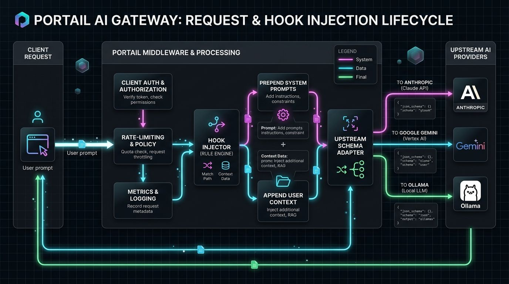
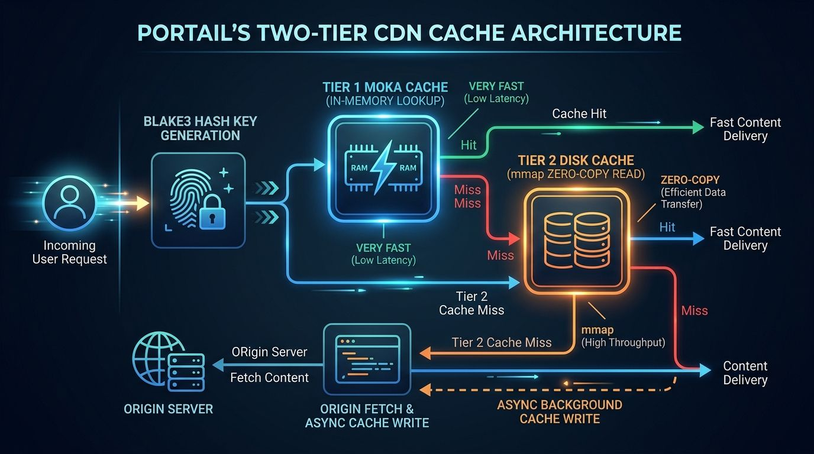

# Data Flow

> Request lifecycle through Portail: ingress → middleware → routing → handler → upstream → response.
> Updated for v2.1.

---

## 1. AI Gateway Flow (`/v1/chat/*`)



This is the primary path — LLM chat completion proxied through hooks.


```
Client                           Portail                           Upstream (LiteLLM/OpenAI/Anthropic)
  │                                │                                      │
  │  POST /v1/chat/completions     │                                      │
  │───────────────────────────────>│                                      │
  │                                │                                      │
  │     ┌─────────────────────────┤                                      │
  │     │  1. axum router matches path                                   │
  │     │  2. Middleware: request ID                    │                 │
  │     │  3. Middleware: logging span  │                                 │
  │     │  4. Middleware: auth check   │                                  │
  │     │  5. Middleware: rate-limit   │                                  │
  │     │  6. Middleware: Prometheus metrics                               │
  │     └─────────────────────────┤                                      │
  │                                │                                      │
  │     ┌─────────────────────────┤                                      │
  │     │  7. Read request body as bytes                                  │
  │     │  8. Hooks: match path/role → inject system messages             │
  │     │  9. Gateway: build upstream request                             │
  │     │     - URL from config / upstream map                            │
  │     │     - Headers: auth, content-type, accept                      │
  │     │     - Body: modified with injected hooks                        │
  │     └─────────────────────────┤                                      │
  │                                │                                      │
  │                                │──── POST /chat/completions ─────────>│
  │                                │    (streaming, with original auth)   │
  │                                │                                      │
  │                                │<──── streaming SSE response ────────│
  │                                │     or JSON response                 │
  │                                │                                      │
  │     ┌─────────────────────────┤                                      │
  │     │ 10. Session tracking: count tokens, duration                   │
  │     │ 11. Publish event: auth success, upstream response              │
  │     └─────────────────────────┤                                      │
  │                                │                                      │
  │<──── streaming/chunked response───────────────────────│              │
  │     or JSON response                                                  │
```

### Implementation (pseudocode)

```
handle_chat_completion(request, state):
    // 1. Extract auth
    principal = authenticate(request.headers)
    if not principal: return 401

    // 2. Rate limit
    if not rate_limit.allow(principal.key): return 429

    // 3. Read + inject hooks
    body = request.bytes()
    hooks = state.hooks.match(request.path, body)
    body = hooks.inject(body)  // prepend/append system messages

    // 4. Forward to upstream
    response = state.gateway.forward(body, auth=principal.token)

    // 5. Track + return
    state.sessions.record(principal, response)
    return response
```

---

## 2. CDN Cache Flow (`/cdn/*`)



Two-tier cache (Moka in-memory → blake3 disk) with zero-copy reads.


```
Client                    Portail                         Origin
  │                         │                               │
  │ GET /cdn/asset/abc123   │                               │
  │────────────────────────>│                               │
  │                         │                               │
  │    ┌────────────────────┤                               │
  │    │ 1. Extract path → blake3 hash(key)                 │
  │    │ 2. Check Moka (in-memory)            │             │
  │    └────────────────────┤                               │
  │                         │                               │
  │              ┌──────────┴──────────┐                    │
  │              │  Moka HIT            │  Moka MISS         │
  │              │  return cached bytes │     ↓              │
  │              └──────────┬──────────┘  ┌────────────────┐ │
  │                         │             │ 3. Check disk  │ │
  │                         │             │    (mmap read) │ │
  │                         │             └───────┬────────┘ │
  │                         │            ┌────────┴───────┐  │
  │                         │            │ Disk HIT        │ │
  │                         │            │ → promote to    │ │
  │                         │            │   Moka          │ │
  │                         │            │ → return bytes  │ │
  │                         │            └────────┬───────┘  │
  │                         │                     │          │
  │                         │            ┌────────┴───────┐  │
  │                         │            │ Disk MISS      │  │
  │                         │            │ → origin fetch │  │
  │                         │            │ → write to     │  │
  │                         │            │   Moka + disk  │  │
  │                         │            │ → return bytes │  │
  │                         │            └────────┬───────┘  │
  │                         │                     │          │
  │                         │                     ├── GET ───>│
  │                         │                     │<── bytes─│
  │                         │                               │
  │<── 200 OK + body ───────│                               │
```

### Cache Strategy

```
request → moka (RAM, TTL=60s) → disk (blake3, mmap) → origin fetch
                ↑                        ↑
          TTL-based eviction        LRU eviction (configurable max size)
```

---

## 3. Event System Flow

```
Any module                     EventLog                         SSE Client / NATS
  │                              │                                    │
  │ event_log.publish(event)     │                                    │
  │─────────────────────────────>│                                    │
  │                              │                                    │
  │        1. Write to ring buffer (in-memory, circular)              │
  │        2. Broadcast to all subscribers (tokio broadcast)          │
  │        3. If NATS bridge active: also publish to NATS subject     │
  │                              │                                    │
  │                              │──── SSE stream ───────────────────>│
  │                              │    (chunked, reconnection support)  │
  │                              │                                    │
  │                              │──── NATS message ─────────────────>│
  │                              │    (distributed to other instances) │
```

### Event Types

| Type | Source | Contains |
|------|--------|----------|
| `auth` | auth.rs | Principal, action, result (pass/deny) |
| `rate_limit` | rate_limit.rs | Key, endpoint, result (allow/block) |
| `cache` | cdn/ | Action (hit/miss/write), key, size |
| `hook` | hooks/ | Hook ID, match result, injection count |
| `agent` | a2a/, a2c/ | Agent ID, action, payload |
| `system` | godfather/, sentinel/ | Health status, resource usage |

---

## 4. Agent-to-Agent Protocol Flow (`/a2a/*`)

Google A2A protocol implementation.

```
Agent A                         Portail                         Agent B
  │                               │                               │
  │ POST /a2a/agents              │                               │
  │ (register agent card)         │                               │
  │──────────────────────────────>│                               │
  │                               │ store agent card              │
  │                               │                               │
  │ POST /a2a/tasks               │                               │
  │ (create task for Agent B)     │                               │
  │──────────────────────────────>│                               │
  │                               │──── task notification ───────>│
  │                               │    (WebSocket push)           │
  │                               │                               │
  │                               │<──── task accepted ───────────│
  │                               │    + streaming updates        │
  │                               │                               │
  │<── task result + artifacts ───│                               │
```

### Task Lifecycle

```
SUBMITTED → WORKING → [STREAMING updates] → COMPLETED / FAILED / CANCELED
```

---

## 5. Agent-to-Consumer Chat Flow (`/a2c/*`)

Human chat with tool use.

```
User                         Portail                         LLM
  │                            │                              │
  │ POST /a2c/chat             │                              │
  │ { message, session_id }   │                              │
  │──────────────────────────>│                              │
  │                            │                              │
  │  1. Look up/create session │                              │
  │  2. Load conversation history                             │
  │  3. Append user message   │                              │
  │  4. Build system prompt   │                              │
  │     (includes available tools)                            │
  │  5. Detect command prefix │                              │
  │     (/research, /code, etc.)  │                           │
  │                            │                              │
  │                            │──── chat completion ───────>│
  │                            │                              │
  │                            │<── streaming ───────────────│
  │                            │    (text or tool calls)      │
  │                            │                              │
  │  If tool_call:            │                              │
  │    6. Execute tool        │                              │
  │       (code execution, search, etc.)                      │
  │    7. Send tool result to LLM                            │
  │                            │                              │
  │<── streaming response ────│                              │
  │     (text + tool results rendered)                       │
```

---

## 6. DNS Resolution Flow (`/dns/*`)

```
Client                         Portail                     DoH Server
  │                            │                              │
  │ GET /dns/resolve?name=     │                              │
  │ example.com               │                              │
  │──────────────────────────>│                              │
  │                            │                              │
  │  1. Check DNS cache (TTL) │                              │
  │  2. Cache HIT → return    │                              │
  │  3. Cache MISS → resolve  │                              │
  │                            │                              │
  │                            │──── HTTPS query ───────────>│
  │                            │    (DoH: Cloudflare/Google)  │
  │                            │                              │
  │                            │<── DNS response ────────────│
  │                            │                              │
  │  4. Cache result (with TTL)                              │
  │  5. Network isolation     │                              │
  │     (split-horizon aware) │                              │
  │  6. Return resolved IPs  │                              │
  │                            │                              │
  │<── 200 + JSON ────────────│                              │
```

### Fallback Chain

```
DoH (Cloudflare) → DoH (Google) → system resolver → error
        ↓                  ↓              ↓
      cache              cache          cache
```

---

## 7. Hook Injection Flow

```
Request arrives
      │
      ▼
Match path patterns (glob)
      │
      ▼
Match request characteristics (role, content-type, headers)
      │
      ▼
Order hooks by priority
      │
      ▼
For each matched hook:
  │
  ├── Prepend system message → add to request body start
  ├── Append system message  → add to request body end
  └── Transform message      → modify specific fields
      │
      ▼
Forward modified request to upstream
```

---

## 8. Config File Watcher Flow

```
Config file change (inotify/FSEvent)
      │
      ▼
ConfigWatcher detects change (cooldown: 500ms debounce)
      │
      ▼
Parse new file → validate structure → validate values
      │
      ├── Valid → swap config (atomic Arc<RwLock> update)
      │            publish "config_reload" event
      │
      └── Invalid → keep current config
                     publish "config_error" event
                     log detailed error
                     rollback (previous valid config saved)
```

---

## 9. Rate Limiting Flow

```
Request arrives with key/token/IP
      │
      ▼
TokenBucket.lookup(key) → create if new
      │
      ▼
Check tokens remaining (GCRA algorithm)
      │
      ├── Tokens >= cost → consume tokens → allow
      │                     set X-RateLimit-Remaining header
      │
      └── Tokens < cost → block with 429
                           set X-RateLimit-Retry-After header
                           publish "rate_limit_blocked" event
```

---

## End-to-End Request Flow (Summary)

```
┌──────────────────────────────────────────────────────────────────┐
│ Client                                                            │
│   │                                                               │
│   ▼                                                               │
│ ┌─────────────────────────────────────────────────────────────┐   │
│ │ axum Router (proxy.rs)                                       │   │
│ │  • Method + path matching                                    │   │
│ │  • 60+ endpoints across all modules                          │   │
│ └─────────────────────┬───────────────────────────────────────┘   │
│                       │                                           │
│                       ▼                                           │
│ ┌─────────────────────────────────────────────────────────────┐   │
│ │ Middleware Stack                                              │   │
│ │  1. Request ID                                                │   │
│ │  2. Tracing span (OTLP)                                       │   │
│ │  3. Structured logging                                        │   │
│ │  4. Auth (JWT / API key)                                      │   │
│ │  5. Rate limit (token bucket)                                 │   │
│ │  6. Prometheus metrics (request count, duration, status)      │   │
│ └─────────────────────┬───────────────────────────────────────┘   │
│                       │                                           │
│                       ▼                                           │
│ ┌─────────────────────────────────────────────────────────────┐   │
│ │ Handler (per-module)                                         │   │
│ │  gateway/ → hooks.inject → forward to upstream               │   │
│ │  cdn/     → cache lookup → Moka → disk → origin             │   │
│ │  events/  → publish → broadcast to SSE subscribers            │   │
│ │  a2a/     → agent card / task lifecycle                       │   │
│ │  a2c/     → chat session / tool execution                     │   │
│ │  mcp/     → unix socket relay                                 │   │
│ │  dns/     → DoH resolution / cache                            │   │
│ │  hooks/   → CRUD store                                        │   │
│ │  ...       (all other modules)                                │   │
│ └─────────────────────┬───────────────────────────────────────┘   │
│                       │                                           │
│                       ▼                                           │
│ Response (streaming, chunked, JSON, SSE, upgrade)                 │
│   • Publish response event to EventLog                           │
│   • Record session metrics                                       │
└──────────────────────────────────────────────────────────────────┘
```
