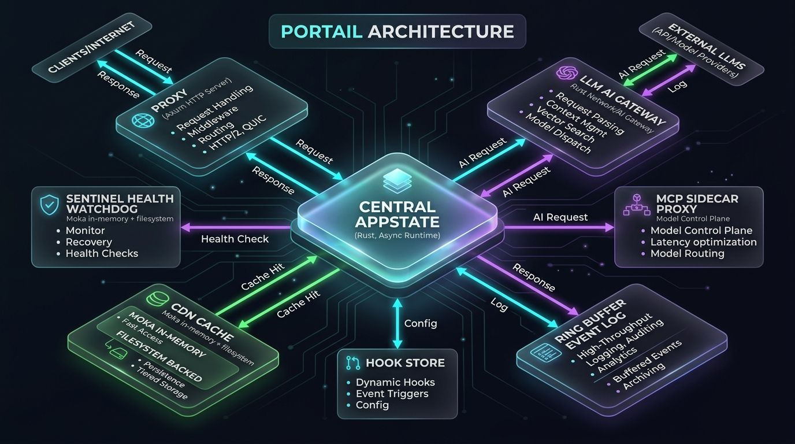

# Portail Design

## Architecture

```
┌─────────────────────────────────────────────────────────────┐
│                      portail binary                         │
│                                                             │
│  ┌──────────┐  ┌──────────┐  ┌──────────┐  ┌──────────┐   │
│  │  proxy    │  │  cdn     │  │  events  │  │  hooks   │   │
│  │  (axum)   │  │  (moka)  │  │  (ring)  │  │  (inject)│   │
│  └─────┬─────┘  └────┬─────┘  └────┬─────┘  └────┬─────┘   │
│        │              │              │              │         │
│  ┌─────┴──────────────┴──────────────┴──────────────┴─────┐  │
│  │                   AppState (shared)                    │  │
│  │  config: RwLock<Config>                                │  │
│  │  event_log: Arc<EventLog>                              │  │
│  │  cdn_cache: Option<Arc<CacheManager>>                  │  │
│  │  hooks: Arc<HookStore>                                 │  │
│  │  metrics_handle: PrometheusHandle                      │  │
│  └────────────────────────────────────────────────────────┘  │
│                                                             │
│  ┌──────────┐  ┌──────────┐  ┌──────────┐                  │
│  │ sentinel  │  │  mcp     │  │ gateway  │                  │
│  │ (health)  │  │ (sidecar)│  │ (llm)    │                  │
│  └──────────┘  └──────────┘  └──────────┘                  │
└─────────────────────────────────────────────────────────────┘
```




## Module Responsibilities

| Module    | Responsibility                              | Dependencies           |
|-----------|---------------------------------------------|------------------------|
| proxy     | HTTP routing, middleware, request handling   | all                    |
| cdn       | Two-tier cache (moka + blake3 filesystem)   | config                 |
| events    | Ring buffer + broadcast channel for events  | hooks                  |
| hooks     | Per-message/per-event prompt injection      | config                 |
| sentinel  | Background health watcher                   | events, cdn            |
| mcp       | Unix socket sidecar launcher                | config                 |
| gateway   | AI upstream forwarding                      | config                 |
| config    | TOML config + CLI args                      | none                   |
| cli       | TUI dashboard + non-interactive commands    | all (read-only)        |

## CLI Design

Single entry point: `portail` binary.

```
portail                    # TUI dashboard (default)
portail serve              # start proxy server
portail status             # show status (text)
portail events             # show events
portail hooks list         # list hooks
portail health             # health check
portail config show        # show config
```

The CLI module (`src/cli/`) contains a single `Dashboard` struct that
renders to either ratatui (interactive) or stdout (non-interactive).
No external state, no shared mutable state — pure rendering.

## Request Flow

```
Client → axum router → middleware (request ID, logging, metrics)
  ├─ /v1/chat/*     → hooks.inject → gateway.forward → upstream
  ├─ /mcp/*         → mcp.proxy → unix socket → python sidecar
  ├─ /cdn/*         → cdn.lookup → cache hit/miss → origin
  ├─ /events/*      → event_log → SSE broadcast
  ├─ /hooks/*       → hook_store CRUD
  ├─ /health        → sentinel status
  └─ /metrics       → prometheus scrape
```

## Data Flow

1. **AI Gateway**: Request → read body → apply hooks (prepend/append system messages) → forward modified body to upstream
2. **CDN Cache**: Request → blake3 hash key → moka lookup → filesystem fallback → origin fetch → cache write
3. **Events**: Agent action → EventLog.publish → broadcast channel → SSE stream
4. **Hooks**: Request path → match hooks → inject system messages → forward
5. **Sentinel**: 30s tick → CDN scrub stats → health check → publish to EventLog

## Hardware Optimizations

- **mimalloc**: Global allocator for 2-3x alloc throughput
- **rustc-hash**: FxHashMap for hot paths (event metadata)
- **blake3**: Native SIMD (SSE2/AVX2/NEON) for cache keys
- **LTO + UPX**: Release binary is fat-LTO + UPX compressed

## Build Profiles

| Profile | LTO | Codegen Units | Strip | UPX | Use Case |
|---------|-----|---------------|-------|-----|----------|
| dev     | off | 16            | no    | no  | Fast iteration |
| release | fat | 1             | yes   | yes | Production |
| bench   | fat | 1             | no    | no  | Benchmarks |
